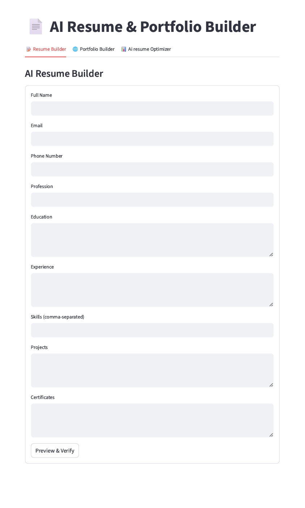

About The Project
AI-Resume-Portfolio-Builder is an GENAI-powered platform designed to optimize resumes for applicant tracking systems (ATS). By leveraging the Google Gemini LLM Model, the system enhances the likelihood of your resume passing through ATS filters and matching specific job descriptions.

𝗙𝗲𝗮𝘁𝘂𝗿𝗲𝘀:

📝 Resume Builder:Generate resume

🌐 Portfolio Builder:Generate Portfolio

📊 Ai resume Optimizer: Optimize resume from below option

      1.  💡 𝗝𝗼𝗯 𝗗𝗲𝘀𝗰𝗿𝗶𝗽𝘁𝗶𝗼𝗻 : Tailor your resume to match the job description perfectly!
      2.  🤖 𝗔𝗧𝗦 𝗖𝗼𝗺𝗽𝗮𝘁𝗶𝗯𝗶𝗹𝗶𝘁𝘆 𝗖𝗵𝗲𝗰𝗸: Ensure your resume passes ATS filters with ease!
      3.  📊 𝗦𝗸𝗶𝗹𝗹𝘀 𝗚𝗮𝗽 𝗔𝗻𝗮𝗹𝘆𝘀𝗶𝘀: Identify missing skills compared to the job requirements.
      4 . ✅ 𝗥𝗲𝘀𝘂𝗺𝗲 𝗙𝗲𝗲𝗱𝗯𝗮𝗰𝗸: Get actionable tips for improvement.
      5.  🎯 𝗥𝗲𝘀𝘂𝗺𝗲 𝗠𝗮𝘁𝗰𝗵 %: See how closely your resume fits the JD.
      6.  📄 𝗔𝘂𝘁𝗼𝗺𝗮𝘁𝗲𝗱 𝗖𝗼𝘃𝗲𝗿 𝗟𝗲𝘁𝘁𝗲𝗿𝘀: Generate a personalized cover letter instantly.
      7.  ⚡ 𝗚𝗲𝗻𝗲𝗿𝗮𝘁𝗲 𝗢𝗽𝘁𝗶𝗺𝗶𝘇𝗲𝗱 𝗥𝗲𝘀𝘂𝗺𝗲: Craft an optimized resume that stands out!

An AI-powered Resume Builder, ATS Resume Optimizer, and Portfolio Generator built using Streamlit and Google Gemini API.
This project helps users create ATS-friendly resumes, analyze job descriptions, calculate overall ATS match score, and generate a personal portfolio website — all in one place.

-----------------------------------------------

  ## Screenshot

   
   
-----------------------------------------------

🛠 Tech Stack

Category-----	Technology

Frontend-----	Streamlit

AI Model-----	Google Gemini

Resume-----  PDFs	ReportLab, FPDF

PDF Parsing-----	PyPDF2

Portfolio-----	HTML + Jinja2

Environment-----	python-dotenv

------------------------------------------------

📂 Project Structure

AI-Resume-Builder/

│── app.py

│── requirements.txt

│── README.md

└── utils/

    │── helper.py
    
    │── processor.py
    
    │── portfolio_generator.py
    
------------------------------------------------
🔐 Environment Setup

Create a .env file in the root directory:

GOOGLE_API_KEY=your_gemini_api_key_here

Activate:

# Windows
venv\Scripts\activate

# Mac/Linux
source venv/bin/activate

3️⃣ Install Dependencies
pip install -r requirements.txt

4️⃣ Run the Application
streamlit run app.py

------------------------------------------------
📊 ATS Score Logic (Overall Score)

ATS score is calculated using weighted components:

Component	Weight
Keyword Match	50%
Skill Match	      30%
Job Title Match	20%
Total	100%

This ensures:

Realistic ATS score

Single source of truth

Chart & score always match

------------------------------------------------

**🌍 Free Portfolio Hosting Platforms**

https://base44.com
------------------------------------------------

**🧠 Future Enhancements**

Skill-wise ATS breakdown

Resume vs JD keyword table

Multi-page resume support

PDF embedding of ATS score

------------------------------------------------

**🤝 Contributing**

Contributions are welcome!
Feel free to fork the repository and submit a pull request.

------------------------------------------------

**📜 License**

This project is licensed under the MIT License.

------------------------------------------------

**⭐ Support**

If you like this project:

⭐ Star the repository

🐛 Report issues

💡 Suggest features
